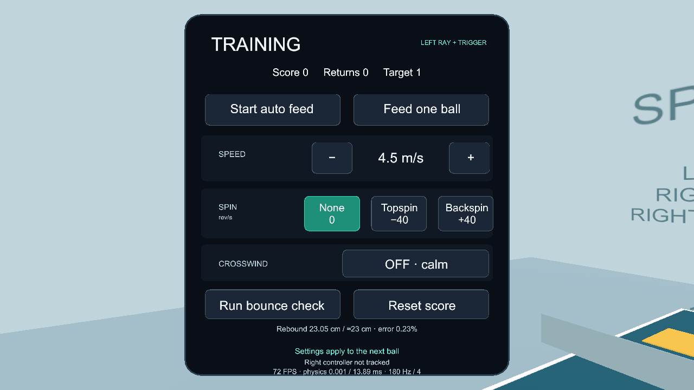

# Demo 2 — Table-tennis spin trainer (Unity / Quest)

A stationary, single-user sports trainer. A machine repeatedly feeds balls toward the player. A controller-mounted racket returns them toward three target zones. The implementation makes launch, flight, moving-paddle contact, spin-dependent bounce/roll, wind and 3D audio visible in a compact scene.

## Open, build, install

Open this folder as a Unity **6000.3.22f1** project. Open `Assets/Scenes/Trainer.unity` and press Play for scene inspection. The menu **Portfolio → Prepare Trainer** regenerates the scene, configures OpenXR and runs numerical checks. **Portfolio → Build Quest APK** creates `Builds/demo2-v1.0.4.apk`.

v1.0.4 corrects the machine-feed arc so new balls clear the net and bounce on the player's half. See [the dated feed record](Validation/feed.md) for exact build/device results. It preserves the settings panel the student confirmed readable/working in v1.0.3, the comfortable palm-centered grip from v1.0.2, and the **UnityPlayerActivity** startup fix from v1.0.1. The build targets **ARM64**, IL2CPP and OpenXR, with Meta Quest Support and Oculus Touch profile enabled. Remaining gameplay and sustained performance still require physical-headset checks.

For a personal Quest, enable Developer Mode. On an ArborXR-managed school Quest, enable **USB Debugging** in the permitted headset settings instead; if the setting is locked, ask the professor/IT to deploy the APK through ArborXR. Do not remove school management. Connect USB and allow the **headset's** USB-debugging prompt (the Mac's USB-access prompt is separate), then run these commands from this folder:

```sh
adb devices
adb install -r Builds/demo2-v1.0.4.apk
adb shell am start -n com.danielaguilar.portfolio.spintrainer/com.unity3d.player.UnityPlayerActivity
```

Alternatively drag the APK into Meta Quest Developer Hub or SideQuest. Launch it from Unknown Sources. The APK is published as a **Release asset**, not a Git source file. This Unity application is not a WebXR browser build.

Release: [demo2-v1.0.4](https://github.com/da42450/vr-portfolio-project-1/releases/tag/demo2-v1.0.4) · [download APK](https://github.com/da42450/vr-portfolio-project-1/releases/download/demo2-v1.0.4/demo2-v1.0.4.apk). The older v1.0 release uses GameActivity and froze on the school Quest 3; do not use it. Video: **pending your YouTube link**.

## Startup compatibility fix

On October 5, 2026, the connected ArborXR-managed Quest 3 installed v1.0 but reported an Android ANR. Its trace showed the main thread waiting in `GameActivity.onSurfaceDestroyedNative`, matching the lifecycle callback described in [Unity issue UUM-139694](https://issuetracker.unity3d.com/issues/6429/application-not-responding-anr-occurs-when-gameactivity-option-is-enabled-in-the-player-settings). This identifies the freeze location, not proof that ArborXR contributes nothing. v1.0.1 changes only the Android entry point/version and adds a `TRAINER_READY` log after scene initialization; gameplay and physics are unchanged. See [ArborXR's managed USB-debugging instructions](https://help.arborxr.com/en/articles/10769343-enable-usb-debugging-on-horizon-managed-services-devices).

The rebuilt v1.0.1 installed and launched on that same Quest 3, initialized the scene, and reached OpenXR's focused VR state. Returning to the Home menu and reopening also rendered successfully, without another observed ANR. The student confirmed seeing the table, moving the paddle with the right controller, and feeding a ball with the right trigger. Brief post-startup runtime samples were approximately **72 FPS at 72 Hz**; this is a startup smoke test, not a sustained gameplay benchmark. See [the dated startup record](Validation/quest-startup.md). Fast paddle contacts, remaining controls/board settings, audio and in-headset bounce validation still need the student's checks.

## Controls

Only the headset and two controllers operate the APK. There is no locomotion or object grabbing.

| Tracked control           | Action                                                                       |
| ------------------------- | ---------------------------------------------------------------------------- |
| Head                      | View and spatial-audio listener                                              |
| Right controller          | Kinematic paddle; swing speed/direction affect contact                       |
| Right trigger             | Feed one ball                                                                |
| Right A                   | Feed repetition on/off                                                       |
| Right B                   | Reset session score                                                          |
| Left controller + trigger | Ray-select Feed, Speed, Spin, Wind, Bounce check or Reset score on the board |

The yellow target rotates after a successful hit. Returns earn 10 points; a landing in the current target earns 100. Readouts include launch speed, spin, current ball speed, swing speed, returns, session score, frame rate and measured physics CPU time. Repeat feeds only when the previous ball is finished, preventing a growing pool of balls.

## Settings panel

The front-left panel faces the player, with rounded cards, a visible pointing ray/hit dot, hover outlines, short press animation and a small left-controller haptic on selection. Selected settings stay highlighted; no hidden click-to-cycle order needs memorizing.

- Speed: **− / +** changes the launch's forward (−Z) component by 1 m/s within 3.5–6.5 m/s. The upward component is calculated separately for the feed arc, so the ball's total speed can be higher. The current preset stays visible; the unavailable endpoint button dims.
- Spin: directly select **None (0)**, **Topspin (−40)** or **Backspin (+40)** rev/s. Signs refer to the machine's incoming flight along −Z: the modeled topspin lift is downward, backspin upward.
- Crosswind: toggle between **OFF · calm** and **ON · 1.5 m/s** along world +X.
- Feed: **Start/Pause auto feed** and **Feed one ball** are separate controls. Right trigger/A/B shortcuts remain available.
- Bounce check: displays **Measuring…**, pauses automatic feed, blocks feed/restart during measurement, then shows the rebound, approximately 23 cm reference and percentage difference. It is a check of the table bounce, not an adjustable bounce coefficient.
- Reset score: clears serves, returns and score; settings are retained.

Speed/spin apply to the next launch; wind affects the active ball's subsequent integration, except the wind-free bounce check. A brief message confirms changes. `TrainerMenu` handles layout/input/feedback; callbacks update the existing state owned by `Trainer`. The left ray reads the Oculus Touch **aim pose**, while the paddle still uses the **grip pose**. The hit dot ends at the same collider used for selection, within four metres. The lightweight unlit panel shader uses [Unity's single-pass stereo shader macros](https://docs.unity.com/en-us/engine/6000.3/manual/xr/graphics/stereo-rendering/single-pass-instancing) and an explicit Resources material to retain it in the APK. No new UI package or image assets are required.



## Paddle grip alignment

Hold the right controller normally; the paddle is always attached, so no grip button is needed. `PaddleGrip` centers the handle at the controller's **grip/palm pose**, not its pointing-ray pose. It maps the model's shaft (+Y) to Unity grip +Z and its blade normal (+Z) to grip +X, a simple shakehand-style baseline. The grip-space axes follow the [Unity grip-pose convention](https://learn.microsoft.com/en-us/windows/mixed-reality/develop/unity/motion-controllers-in-unity); the racket dimensions and chosen hold are authored, not a measured equipment calibration.

The whole rule is `faceRotation = gripRotation × ModelToGrip`, then `facePosition = gripPosition − faceRotation × HandleCenter`. Therefore the handle center stays at the hand for any controller rotation. Visuals are children of the tracked controller and update each render frame; the fixed-step contact solver uses the same rule. Tracking is sampled before the trainer's Update. Three grip orientations and six two-sided high-speed contacts passed automated checks. After installation on October 5, the student confirmed the grip feels normal without wrist twisting. This is subjective comfort confirmation, not full gameplay validation. See [the grip validation record](Validation/paddle-grip.md).

## How the four/five systems work

- Launch: preset forward speed/spin; a short force-model prediction and 16-step binary search choose the initial vertical velocity for a bounce at z=0.85 m on the player's half. Results are cached per speed/spin/wind preset. The live ball is not steered or teleported after launch.
- Flight: semi-implicit Euler with gravity, quadratic drag and bounded Magnus lift. Wind changes relative air velocity, adding the fifth interacting system.
- Tracked contact: `TrackedPose` samples poses in Update. Differences between samples provide translation/angular velocity; the velocity at the contact point includes `ω×offset`. The Rigidbody paddle is kinematic and moved in FixedUpdate.
- Surface: restitution changes the normal velocity, friction acts on contact slip, and tangential impulses change both translation and spin. This means spin visibly changes a table bounce. Low-speed floor/table contact transitions to a simplified rolling loss.

The simulation owns the ball state explicitly rather than combining a custom solver with PhysX forces on a dynamic ball. `BallPhysics` contains the short force/integration/contact rules. `Trainer` sweeps the sphere segment against world colliders and sweeps relative ball/paddle motion against the moving racket face. Four substeps account for paddle rotation. Continuous sweeps detect intersections between old/new poses even if the endpoint is beyond the thin surface; this is custom continuous detection, not simply setting a Rigidbody CCD flag.

`Time.fixedDeltaTime=1/180` gives consistent force integration. Four inexpensive sweeps per step help with fast contacts. A lower frequency increases numerical error and changes spin/drag integration; a higher frequency costs more CPU. One ball, a fixed hit buffer, pooled impact AudioSources, low-poly geometry and no realtime shadows limit cost. The board compares measured physics CPU time with a 72 Hz frame's 13.89 ms budget; that comparison is not proof of total GPU time. Verify the real headset's current refresh rate and sustained frame rate.

`SpatialAudio` uses mono generated clips with `spatialBlend=1`, logarithmic attenuation and Doppler. Approach sound follows the ball; impacts occur at their contact points; room ambience has a world position. Table, paddle and floor have different tones and decays, while speed changes volume/pitch. This uses Unity's 3D panning/attenuation; no proprietary HRTF plugin is installed.

## Feed/net correction

The old gravity-only launch aimed for a low bounce just past the net and ignored drag/spin when selecting the arc. The force-model regression flagged 16 of 24 old presets as invalid (insufficient net clearance or a first bounce before crossing). `FeedTrajectory` now predicts with the same gravity, drag, Magnus, wind, spin decay and timestep as play. It changes only the initial upward velocity to aim for z=0.85, about 52 cm from the table's near edge. All 24 current presets also passed real-scene sphere casts: no net strike before a first bounce on the player's half. The minimum ball-bottom clearance above the net is 7.29 cm. See `Validation/feed-numerical-results.json` and `Validation/feed-scene-results.json`.

The net's dimensions/collider and all force/contact coefficients are unchanged. A return hit too low can still strike the net; the panel now says **Net hit · angle the paddle slightly upward**. This is feedback, not an automatic return assist. The 30 cm bounce benchmark remains independent of feed-arc selection.

## Accuracy, sources and limits

See [PARAMETERS.md](PARAMETERS.md) for every sourced quantity, derived quantity and explicitly labeled assumption. The numerical benchmark is **23.004 cm**, the actual editor scene measurement **23.054 cm**, against the ITTF's approximately **23 cm** bounce for a **30 cm** drop. Run Bounce check on Quest and show this comparison. Spin-dependent bounce and high-speed segment detection also passed numerical checks.

Known limits: constant approximate drag, bounded approximate lift, simple friction/rolling, a rigid elliptical paddle, no deformable rubber or measured brand-specific coefficients. The code is a real-time teaching model, not a professional predictive simulator. The automatic Unity Editor search index emitted an internal editor exception during play verification; the application scripts produced no runtime exception, and the scene's bounce routine completed. Basic right-controller tracking/feed now passes on Quest; the remaining input/contact/audio checks and compliant video are pending.

## Video proof (about 5 minutes)

Show headset view plus live-action inset throughout. Feed several balls; compare swing speeds/directions and readouts; show targets and repetition. Compare spin presets, table bounce and wind. Run the 30 cm bounce check and read the measured result and reference. Show spatial approach/impact sounds (stereo capture if possible), material/intensity variation, then explain the fixed step, pose velocity, restitution, friction, drag/Magnus, sweeps and frame-budget choices. Describe an approximation honestly and what measurement would improve it.
