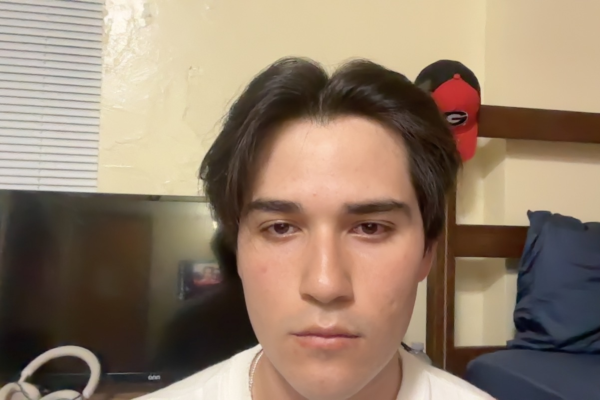

# Daniel Aguilar — VR Portfolio Project 1

CSCI 4830, University of Georgia, Fall 2026. Due October 8, 2026, 11:59 pm.

Course submission repository: [ugavrclass2026/portfolio-1-da42450](https://github.com/ugavrclass2026/portfolio-1-da42450) (private). This public repository provides GitHub Pages hosting; the course repository receives the same development history and a tagged Quest APK Release.



**Bio:** Daniel Aguilar is a student taking Virtual Reality at the University of Georgia. This portfolio demonstrates graphics, simulation, manipulation, and locomotion through four focused interactive applications.

| Demo                                         | What it demonstrates                                                                                 | Deployment                                                                                             | Video                                            |
| -------------------------------------------- | ---------------------------------------------------------------------------------------------------- | ------------------------------------------------------------------------------------------------------ | ------------------------------------------------ |
| [Demo1_Ride](Demo1_Ride/README.md)           | Code-driven transform hierarchy, authored UVs, normal/emission maps, lighting, rider camera          | [Desktop WebGL](https://da42450.github.io/vr-portfolio-project-1/Demo1_Ride/)                          | [YouTube — Demo 1](https://youtu.be/aYnfPb46d2c) |
| [Demo2_Trainer](Demo2_Trainer/README.md)     | Unity physics, swept contact, spin, tracked velocity, 3D audio, practice feedback                    | [Course Quest APK Release](https://github.com/ugavrclass2026/portfolio-1-da42450/releases/tag/demo2-v1.0.4) · [public mirror](https://github.com/da42450/vr-portfolio-project-1/releases/tag/demo2-v1.0.4) | [YouTube — Demo 2](https://youtu.be/c6n03vLm3SU) |
| [Demo3_Procedure](Demo3_Procedure/README.md) | Seven substantive fire-response outcomes, recoverable errors, two-handed manipulation, sliders/hinge | [WebXR](https://da42450.github.io/vr-portfolio-project-1/Demo3_Procedure/)                             | [YouTube — Demo 3](https://youtu.be/vSC8ISrWH2g) |
| [Demo4_Hunt](Demo4_Hunt/README.md)           | Four regions, 5 targets / 20 distractors, teleport and smooth travel, comfort                        | [WebXR](https://da42450.github.io/vr-portfolio-project-1/Demo4_Hunt/)                                  | [YouTube — Demo 4](https://youtu.be/hUUlV8C-KY8) |

Public portfolio: **[GitHub Pages](https://da42450.github.io/vr-portfolio-project-1/)**. Demos 3/4 have immersive WebXR; Demo 1 is desktop WebGL; Demo 2 is a native Unity application, not a browser demo.

## Run locally

```sh
npm install
npm start
```

Open `http://localhost:8080`. Three.js is pinned to 0.180.0 and vendored locally, so the static web demos do not depend on a CDN. `npm test` checks grab targeting/attachment/release, graphics, procedure ordering/recovery, hunt scoring, and settings validation. `npm run check` checks JavaScript parsing and required entrypoints.

For Unity, open the `Demo2_Trainer` directory in Unity **6000.3.22f1**. The generated scene is `Assets/Scenes/Trainer.unity`. The Portfolio menu regenerates the scene/configuration, validates the physics, and builds the Quest APK. Android Build Support, SDK/NDK and OpenJDK are required.

Desktop controls provide inspection; headset/controller interaction and headset frame rate must be checked on a physical Quest before submission. For Demos 3/4, open their GitHub Pages links in the Quest browser and select **Enter VR**. The button activates only on a supported browser. Quest requires **public HTTPS**, not the computer's HTTP LAN address. Demo 1 deliberately disables immersive XR; its desktop demonstration covers the assigned graphics criteria.

## Submission status

The final submission includes all four demo sources and READMEs, the student's headshot and biography, an AI tooling inventory, YouTube links, public HTTPS deployments and the tagged v1.0.4 Quest APK in the private course repository's Releases. Videos are unlisted and remain available by link; Demos 2–4 combine Quest footage, live-action footage and the student's prerecorded narration throughout. The source reaches both repositories with development history preserved; [SUBMISSION.md](SUBMISSION.md) records the final delivery checks. The earlier [audit](AUDIT.md) is a historical pre-recording review, not the final status. [RUBRIC.md](RUBRIC.md) maps implementation to the required evidence; the professor still evaluates what is actually demonstrated, and no automated check guarantees full marks. [QUIZ_GUIDE.md](QUIZ_GUIDE.md) explains the actual code in lecture vocabulary for the separate 30-point quiz.

Every push to `main` runs `.github/workflows/pages.yml`: install pinned dependencies, run tests/checks, package static files, then deploy to Pages. Unity source and build caches are excluded from the published website; the APK is a separate GitHub Release asset.

## AI tooling

- Codex desktop coding agent, primarily **GPT-6.1 Sol** (model selector identifier `gpt-6.1-sol`, as reported by the student), for implementation, project/rubric discussion, debugging, documentation and video assembly. No more specific model build identifier was recorded.
- Shell commands and Unity's batch-mode CLI for compilation and Android builds.
- Browser automation through the Codex computer-use integration for interaction and visual checks.
- FFmpeg 7.1.1 / ffprobe for combining the student's recordings, audio levels, export checks and video metadata; QuickTime / Photo Booth and Quest recordings supplied the footage, and the student prerecorded narration with Voice Memos.
- No Unity MCP, generated third-party 3D models, or image-generation tools were used for these implementations.

I worked conversationally with the coding agent: I asked it to interpret the rubric, build the scenes and scripts, document the mechanisms, and check state logic, browser behavior, Unity compilation and physics. I tested on Quest and reported awkward grips, failed feeds, poor controls, and view/height problems; the agent used those reports, logs and regression tests to revise the implementation. Inspection also found hidden-menu ray hits, poorly wrapped instructions, inward cabin normals and mirrored/overlapping Unity text. An explicit resource material prevents runtime-created Unity shaders being stripped from the APK. The gondola fault toggle deliberately removes counter-rotation for diagnosis; it is not a spontaneous bug. The videos show my own operation and narration, assembled from my recordings. Automated checks and spot-reviewed footage are not proof of every physical interaction or a sustained performance benchmark. I remain responsible for explaining the implementation in the portfolio quiz.

## Assets and dependencies

All scene meshes, textures, signs and tones are authored procedurally in the source. Three.js is MIT licensed; its license is in `Shared/vendor/THREE-LICENSE.txt`. Unity packages are pinned by `Demo2_Trainer/Packages/manifest.json` and `packages-lock.json`. Physical and procedural sources are linked in the demo READMEs.
